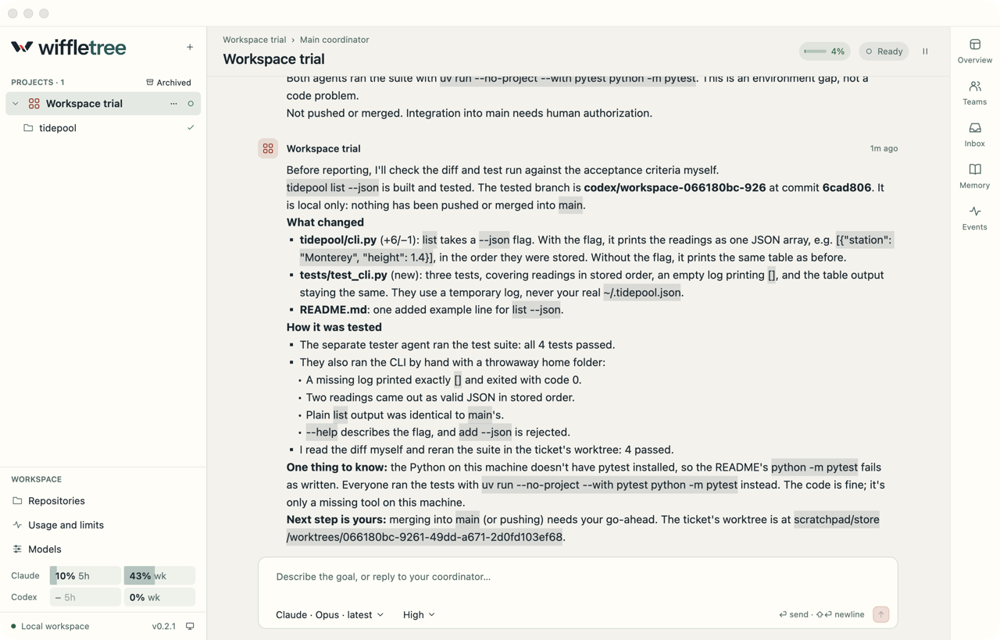
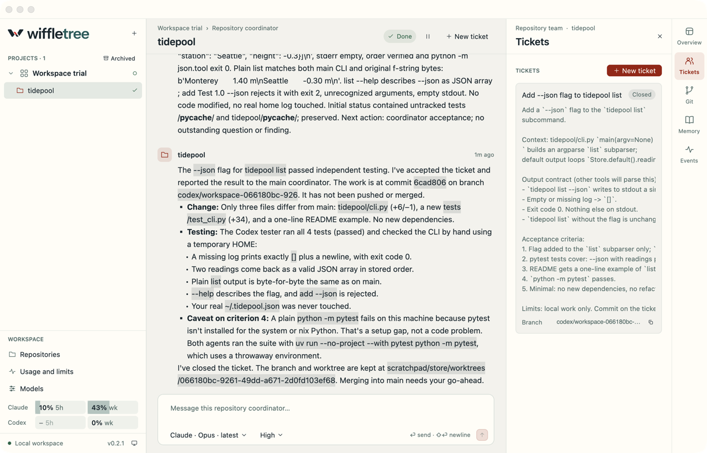
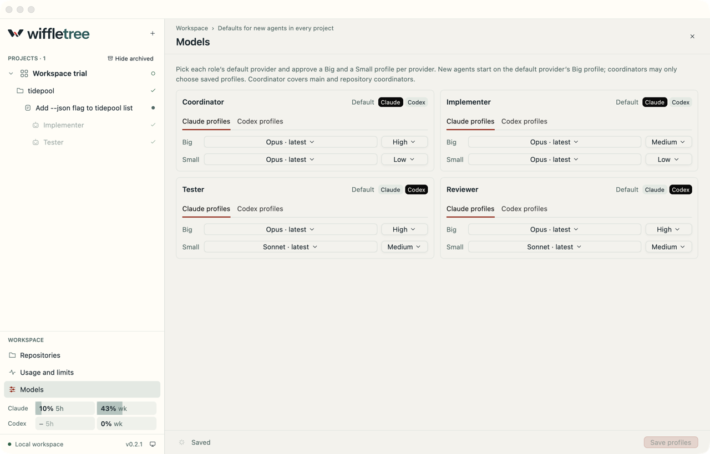

<p align="center">
  
</p>

<p align="center">
  <strong>A native Mac workspace where Claude and Codex agents work as a team.</strong><br>
  Give one coordinator a goal. It plans the work, staffs each repository, and reports back with tested branches.
</p>

<p align="center">
  <a href="https://github.com/Vyttle-LLC/wiffletree/releases/latest"></a>
  
  <a href="LICENSE"></a>
</p>



<table>
  <tr>
    <td width="50%"></td>
    <td width="50%"></td>
  </tr>
  <tr>
    <td align="center"><sub>A coordinator accepts a ticket after independent verification.</sub></td>
    <td align="center"><sub>Any role can run on Claude or Codex.</sub></td>
  </tr>
</table>

## Install

Wiffletree runs on Apple Silicon Macs with macOS 13 or later. Install the latest release with one command:

```sh
curl -fsSL https://raw.githubusercontent.com/Vyttle-LLC/wiffletree/main/scripts/install.sh | bash
```

The script downloads the signed and notarized app from [Releases](https://github.com/Vyttle-LLC/wiffletree/releases/latest), checks it with Gatekeeper, moves it to `/Applications` and opens it. Run it again any time to reinstall. To install somewhere else, set `WIFFLETREE_INSTALL_DIR=~/Applications`. If you prefer to do it by hand, download `Wiffletree-<version>-macos-arm64.zip`, unzip it and drag `Wiffletree.app` to Applications.

Wiffletree drives the agent CLIs you already use, so install [Claude Code](https://code.claude.com), [Codex](https://github.com/openai/codex) or both, and sign in:

```sh
claude auth login
codex login
```

Then press **⌘N**, add a repository, and tell the coordinator what you want built. [Your first project](docs/DEVELOPMENT.md#first-project) walks through it step by step.

**Updates are automatic.** The app checks hourly, downloads new versions in the background and shows a card in the sidebar with what changed. Click **Restart to update**, or just quit. To check right away, click the version number at the bottom of the sidebar.

> [!WARNING]
> Agents run with their provider's permission prompts bypassed so they can work unattended. Add only repositories you are comfortable letting them change. Wiffletree itself never pushes or merges, but agents can run any command on your Mac.

## Why we built this

Coding agents got good enough that the bottleneck moved. The hard part is no longer getting one agent to write code. It is keeping five of them pointed at the same goal across three repositories, and still knowing what is going on.

The tools we had were terminal managers organized around repositories. They show you a lot, but the work we care about is a feature, a bug or an outcome, and those cut across repositories. Coordination meant pasting text into terminals, so nobody could say for sure whether a message had arrived, been read or been acted on. When something crashed, the plan lived only in our heads.

We wanted to hand off a goal the way you would to a strong team lead, then check in when it mattered. So we built a workspace around that idea instead of around terminals.

## How work gets done

Wiffletree has opinions about how agent work should be organized.

**Projects are outcomes, not repositories.** A project is a feature, a bug or any goal you want reached. Repositories are attached to it, and one repository can serve many projects at once.

**You talk to one coordinator.** Each project has a coordinator that owns the goal and the conversation with you. It plans, asks you the questions that matter and reports the result. You do not have to manage the agents underneath it.

**Each ticket is its own workspace.** The coordinator breaks the work into tickets, one repository each, with its own branch and worktree. It assigns an implementer, then verifies with one call that runs every configured tester and reviewer at once on the same commit, and accepts the result.

**Tickets are small, isolated and tested by someone else.** Every ticket gets its own Git worktree and branch. An implementer builds it, and a separate tester checks it against the acceptance criteria. "The turn ended" never counts as "it works."

**Blocked is not the same as needs-you.** Workers report blockers to the coordinator, which resolves most of them. Only the coordinator escalates to you, and it gathers its questions in one Inbox so you answer them once.

**Any model can play any role.** Claude can coordinate Codex implementers, and Codex can coordinate Claude. You set a default model for each role, and you can override any single agent.

**Messages are durable.** Agents talk through the app's message queue, not by typing into each other's terminals. Every message is saved before it is acknowledged, and an idle recipient wakes the moment one arrives. After a restart, each agent resumes its exact provider session, and the app never silently retries work that might have had side effects.

**Software does the routine work; models do the thinking.** Git state, status, polling and usage tracking are ordinary deterministic code. Models are woken only for decisions that need reasoning, so coordinators sleep between events instead of polling.

**Humans own integration.** Agents deliver tested branches. Wiffletree does not push, open pull requests or merge on its own.

**It should feel instant.** Wiffletree is a native Rust app built on [GPUI](https://github.com/zed-industries/zed/tree/main/crates/gpui), not a web view, and it stays light when idle.

## Status

Wiffletree is early software, and it changes quickly. Live Claude and Codex runs, exact session resume and mixed-provider handoffs work today. Integration is manual, everything runs on your Mac, and closing the app stops active turns until you resume. See [current limits](docs/DEVELOPMENT.md#current-limits) and the [product requirements](docs/PRD.md) for what comes next, including a headless host you can drive from another machine.

## Build from source

You need macOS on Apple Silicon, a recent stable Rust toolchain and Xcode with its Metal toolchain.

```sh
bash scripts/package_macos.sh
open target/Wiffletree.app
```

Use `--beta` to build a separate **Wiffletree Beta** that runs beside the installed app with its own store. To try it against a scratch store without packaging:

```sh
cargo build --locked --release -p workspace-host -p workspace-desktop
./target/release/workspace-desktop \
  --data-dir /tmp/wiffletree-preview --demo-repository "$PWD"
```

[Development notes](docs/DEVELOPMENT.md) cover model configuration, headless commands, validation and releases. [Measured host timings](docs/performance/host-baseline.md) are kept separate from the desktop and provider performance targets, which are not yet verified.

## Contributing

Contributions are welcome. Start with [CONTRIBUTING.md](CONTRIBUTING.md) for the workflow and the checks every pull request must pass. For anything larger than a small fix, open an issue first so we can agree on the approach.

Useful places to start reading:

- [Product requirements](docs/PRD.md): the source of truth for scope, architecture and performance budgets.
- [Design guide](design/README.md): the current interactive mockup, earlier studies and their limits.
- [Brand kit](design/brand/README.md) and [colors](design/brand.md): the Interlock mark and the Tidal palette.

To report a vulnerability, follow [SECURITY.md](SECURITY.md) instead of opening a public issue.

## License

Wiffletree is released under the [MIT License](LICENSE). The bundled Instrument Sans subset used for the wordmark is under the [SIL Open Font License](design/brand/source/OFL.txt).
