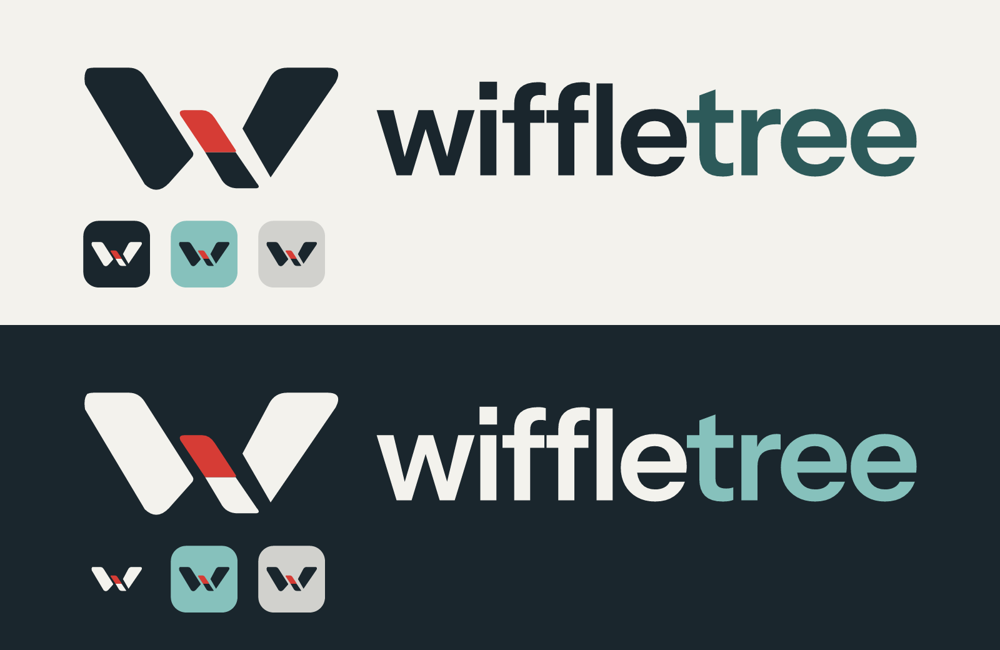

# Wiffletree brand kit

**Selected October 5, 2026:** Interlock open joint, with a red connection and the original two-tone wordmark. Built on the [Tidal palette](../brand.md). Use **Wiffletree** in prose and the supplied lowercase **wiffletree** artwork in logos.



## The mark

The open-joint W represents separate parts working together. Its central connection is **Signal red `#D63C35`**, replacing peach in the selected concept. The outlined vector redraw is the delivery source; the retained concept image documents the selected direction.

The wordmark keeps **Instrument Sans SemiBold (600)** and **−0.03em tracking** from the original kit. Two-tone lettering is the default:

| Background | “wiffle” | “tree” | Symbol joint |
| --- | --- | --- | --- |
| Light | Deep teal `#1A262D` | Tide `#2D5A5A` | Signal red `#D63C35` |
| Dark | Off-white `#F3F2ED` | Sea glass `#86C1BC` | Signal red `#D63C35` |

The wordmark uses the font's original i dot in the text color. The old colored squoval and shoulder-dot icon are superseded. The red accent appears once, in the symbol.

## Files

| Folder / file | Contents |
| --- | --- |
| `logo/wordmark-two-tone-{light,dark}.svg` | Default outlined wordmarks |
| `logo/wordmark-{light,dark}.svg` | Solid wordmarks for restrained or small applications |
| `logo/wordmark-mono-{deep-teal,white}.svg` | Single-color wordmarks |
| `logo/lockup-{light,dark}.svg` | Primary lockups: free-standing symbol with two-tone wordmark |
| `logo/lockup-{sea-glass-light,tide-dark}.svg` | Alternate lockups with tiled icon |
| `logo/symbol-{light,dark}.svg` | Free-standing symbol with red joint |
| `logo/symbol-mono-{deep-teal,white}.svg` | Single-color symbol |
| `icon/` | Rounded app tiles, small-size variants, SVG and ICO favicons |
| `png/` | Transparent raster exports, app icons, favicons and review sheet |
| `preview.svg` | Light/dark review sheet with backgrounds |
| `source/` | Generators, subset font and selected concept provenance |

### App icons

| Tile | Use | Symbol / joint |
| --- | --- | --- |
| Deep teal `#1A262D` | Primary app icon and favicon | Off-white / Signal red |
| Stone `#D1D1CD` | Neutral alternative on dark surfaces | Deep teal / Signal red |
| Sea glass `#86C1BC` | Distinctive alternative for docks and marketing | Deep teal / Signal red |
| Tide `#2D5A5A` | Supporting dark variant | Off-white / Signal red |

Small variants enlarge the complete symbol from 76% to 82% of the tile width. Use them at 48 px and below. Favicons are exported separately at 16, 32 and 48 px; the red detail is secondary to the silhouette at these sizes.

## Usage

- Use the two-tone wordmark by default. Switch to solid lettering at small sizes or for single-color reproduction.
- Keep full wordmarks at least 128 px wide on screen; below that, use the symbol or app icon. Treat this as the kit's practical baseline and check the actual display context.
- Keep at least one lowercase x-height of clear space around a lockup; keep at least 25% of the tile width clear around a standalone app icon.
- Use the `light` files on light backgrounds and the `dark` files on dark backgrounds. Sea glass lettering belongs on dark backgrounds; Tide lettering belongs on light backgrounds.
- Keep red confined to the joint. Do not add a second red accent to the i dot, recolor the wordmark red, stretch the artwork, or introduce gradients, texture or shadows.
- All delivery SVGs contain outlines and solid fills; no installed font or network resource is required.
- Signal red belongs to the logo. The interface's rust/ember action colors and separate status colors are unchanged.

## Typography

| Role | Typeface |
| --- | --- |
| Logo and brand surfaces | Instrument Sans; body 400–500, headings 600 |
| Native app UI | macOS system family, per the [native baseline](../brand.md) |
| Code and terminal | The interface's monospace setting |

Always use the supplied logo artwork rather than retyping it.

## Regenerating

From the repository root:

```sh
uv run --with fonttools python design/brand/source/gen.py
uv run --with resvg-py --with pillow python design/brand/source/export.py
```

Alternatively, install those dependencies in your existing Python environment and invoke the scripts with Python. FontTools outlines the bundled font; resvg renders the SVGs without a browser or system fonts; Pillow packages the ICO. Both scripts resolve their inputs relative to their own location. `gen.py` optionally accepts an SVG output directory.

The generator defines the three dark strokes and red joint on a 444 × 214 grid. `TRACK` controls wordmark spacing; `mark_elems` and `icon_elems` control mark and tile placement. The original Instrument Sans subset is unchanged. Instrument Sans is © The Instrument Sans Project Authors, licensed under SIL Open Font License 1.1.

The concept was explored with the built-in image generation tool. `source/interlock-selected-concept.png` and `source/interlock-selected-concept.json` retain the chosen red study and its final edit prompt. The selected concept used a single-color wordmark; the production vectors restore the original two-tone lettering at Michael's request.
