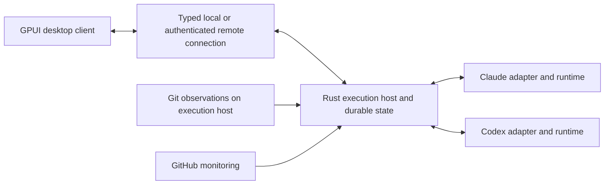

# Wiffletree — Product Requirements

Draft PRD · Updated October 5, 2026 · Product owner: Michael

Build a native desktop workspace for coordinating Claude and Codex sessions across repositories, starting on macOS. Use Rust for the orchestration host and GPUI for the initial client, with Tauri and TypeScript/Svelte as the fallback if the GPUI prototype fails its acceptance criteria. A project is a feature, bug or other outcome. Its main coordinator owns the overall goal and user conversation. One repository coordinator per project/repository coordinates all tickets for that repository. Implementation and testing agents each belong to one ticket. Michael can inspect and talk to every session directly, while routine coordination stays with orchestrators.

The product must feel immediate, remain inexpensive when idle, and deliver messages reliably. The app owns coordination, persistence, Git state, monitoring, shared Markdown knowledge and scheduled maintenance. Provider runtimes own model execution, tools, and conversation context. No terminal interface is required for the first release.

Rust and GPUI are the selected starting stack; Tauri is the fallback, not a parallel implementation. Detailed architecture choices and performance budgets below remain proposed requirements, not measured results. Wiffletree is the product name, selected October 5, 2026. Tidal is the selected brand palette, with paired light and dark modes. Celadon remains the example project used in the design studies.

## Problem and desired outcome

Existing agent terminal managers provide useful visibility, but organizing primarily around repositories makes cross-repository work harder to follow. Coordinating by injecting text into terminal sessions also makes delivery, interruption, and recovery difficult to reason about.

The desired outcome is one project tree in which each row has a clear owner, conversation, status, and relevant Git state. Michael can delegate a goal, follow progress, inspect a branch graph, address PR feedback, and direct history changes without juggling terminals or losing track of work.

Primary user: Michael, initially working locally on Apple Silicon with several repositories and existing Claude and Codex accounts. The first usable release is a personal, single-user macOS application. The architecture must support a macOS client controlling a Linux execution host in a subsequent delivery stage, and allow future desktop clients without rewriting orchestration.

## Scope and principles

- macOS first, with a portable Rust host and a client boundary independent of GPUI. Validate the minimum macOS version against GPUI and provider runtimes. Linux execution and remote control are planned capabilities; a Linux graphical client can follow separately.

- Provider choice is independent of role. Claude can coordinate Codex workers, and the reverse must work.

- Each visible agent is an independent session managed by the app. Native provider subagents may be internal helpers, but are not required for orchestration.

- Project orchestrators have no repository or Git branch. Their runtime context lives in app-managed project storage; shared knowledge can live in an attached Markdown brain repository.

- Repository coordinators own work allocation and integration responsibilities across their project’s tickets. They persist for the project, not across unrelated projects. Concurrent tickets have isolated worktrees and branches; a ticket’s implementer and tester operate sequentially in its workspace.

- Keep the interface compact. Load detail on demand instead of rendering every transcript at once.

- Make message and operation state observable. Queued, delivered, acknowledged, and completed mean different things.

- Keep source control and monitoring deterministic. Use models for decisions that require reasoning, not routine polling or status calculation.

Out of scope for the first usable release: remote execution, a Linux graphical client, Windows, managed cloud hosting, multi-user collaboration, a full code editor, terminal emulation, automatic provider switching within a conversation, arbitrary workflow scripting, and unrestricted automatic merges. A standalone headless host on macOS and Linux, controlled from another computer, is a planned delivery stage. The core must have no GUI dependency from the start.

## Project hierarchy and ownership

| Entity | Responsibility | Git workspace |
| --- | --- | --- |
| Project / main coordinator | One feature, bug or outcome; user conversation, planning, cross-repository decisions and escalation | App-managed project home |
| Repository coordinator | One development team for this project/repository; decomposes, dispatches and accepts all its tickets | Reads attached repository; owns integration planning |
| Ticket / task | Bounded work with acceptance criteria, dependencies and evidence | Isolated worktree and branch |
| Implementer, tester or reviewer | One role on one ticket; resumes for fixes or retests on that same ticket | Uses the ticket workspace; one active agent per ticket |
| Watcher | Observes Git, GitHub and runtime changes | Ordinary background software |

The project is the outcome, the repository is an attachment, and a task is a ticket within the project. Ten frontend tickets share one frontend coordinator; five backend tickets share one backend coordinator. Neither coordinator is reused by unrelated projects. Each ticket gets its own workers. Coordinators sleep without model calls between events and resume the same provider conversation when needed.

```text
Theme rollout                         Project / main coordinator
  Frontend                            Repository coordinator
    Toolbar styling                   Ticket
      Implementer                     One ticket · Codex
      Tester                          One ticket · Claude
    Theme initialization              Ticket
      Implementer                     One ticket · Codex
  Backend                             Repository coordinator
    Palette contract                  Ticket
      Implementer                     One ticket · Claude
      Tester                          One ticket · Codex
```

A repository may participate in several projects. The app must arbitrate operations across all of them by canonical repository and branch identity. Two sessions cannot independently own the same writable integration branch or worktree. Assignments declare ownership and dependencies before execution.

## Interface requirements

The sidebar follows project/main coordinator → repository coordinator → agents. Tickets do not get rows of their own: each agent row leads with its role and follows it with its ticket's title in secondary text, and agents on the same ticket stay together. The Teams panel lists tickets with their state. “New project” is the primary creation action and creates the main coordinator. Conversations belong to coordinator and worker sessions. Compact rows show status glyphs with accessible names and hover detail; PR identity and provider details are available in context without widening every row.

Selecting any session opens its conversation; selecting a ticket opens its owning coordinator’s Tickets inspector. The main coordinator is the primary interaction surface. Repository coordinator and worker conversations remain available for optional inspection or intervention; inspecting them is not required to resolve normal orchestration.

Relevant workspace tabs:

- Conversation: streamed visible output, tool activity, direct messages and permission requests.

- Branch history: graphical commit ancestry, local and remote refs, target base, ahead and behind state, selected commits, and history-change proposals.

- Changes: committed and working-tree diffs with file selection.

- Pull request: PR description, head and base, reviews, unresolved threads, comments, checks and merge state.

- Activity: agent messages, operations and watcher events with source and timestamps.

Project-level monitoring summarizes affected repositories and routes attention to the responsible coordinator. Repository selection remains available when a coordinator session is stopped.

Commit selection can become an instruction such as “Squash these fixes into the endpoint commit, then rebase on the feature branch.” The interface shows affected refs, commits, and proposed outcome before a shared-history rewrite. PR links open the corresponding GitHub page. Status must distinguish cached, fresh, stale, and unavailable data.

New project creates a main coordinator. Add repository team creates the project’s coordinator for one of the repositories it uses. New ticket and Assign ticket agent are scoped to that repository team. Repositories belong to the workspace. Each project uses every workspace repository by default, including ones added later, or a set the user chooses; a project drops a repository only once no active team of its works there. Michael may inspect, message, pause, resume, archive or restore any agent directly. Archiving a session hides it and the sessions it owns, stops scheduling them and preserves their conversations, tickets and worktrees; restoring brings back the session and its owners. Archive is never deletion. Direct instructions are visible to the owning repository coordinator.

### UI layout exploration

The current interactive direction uses the Tidal palette with Chat as the default workspace. The conversation fills the available width beside a compact project → repository team → ticket → agents tree. Files, Overview, Git history, changes, PR feedback, Brain, scheduled work, usage and activity open only when requested in a contextual side panel. The composer supports attachments and scope selection. Enter submits the draft; Shift Enter inserts a newline. Context panels preserve the conversation and draft; closing them restores the full chat width.

Project/team navigation lives in a compact inspector rail at the right edge of the workspace. It follows the selected conversation and opens an adjacent, resizable inspector whose header names the scope and owner. Projects expose Overview, Teams, Inbox, Memory and Events; repository coordinators expose Overview, Tickets, Git, Memory and Events. Workers omit team management and human Inbox; the Inbox entry shows the count of open decisions. The rail holds only what belongs to the selected session, including its context window. Information about the whole workspace, namely account limits, recorded usage and model defaults, opens as full pages from a Workspace section in the sidebar and always covers both providers. A project needs no step to go live: a human message, a retry or an answered decision starts it, and Stop interrupts it. Shared project memory and workspace-wide role defaults are explicitly identified within their views. Closing the inspector restores conversation width while the rail remains available.

New project immediately creates a saved project/main coordinator with a default name and focuses inline naming in the sidebar. Enter or clicking away saves; blank input or Escape preserves the existing name. Project names can be edited later by double-clicking their row or using its rename button. Renaming preserves the project ID, storage path and conversation. Other creation actions open focused dialogs: Add repository team selects a project repository attachment; New ticket captures its brief and acceptance criteria; Assign ticket agent selects a ticket and role; Add repositories is reachable from the workspace Repositories page, the project's sidebar menu and its Overview, and opens first when a team is added to a project without repositories. Adding from a project that chose its own set also includes the new repositories in it. Choose repositories in the Overview switches a project between every workspace repository and a chosen set. Parent folders are remembered as root folders and rechecked on launch, window activation (rate-limited) and opening the Repositories page, off the host thread and with read-only Git only for unknown folders; new repositories join the workspace, while linked worktrees, empty repositories and anything the user unticked or removed stay out. Missing folders are flagged, not deleted. It accepts repository roots and multiple parent folders (such as ~/dev/* and ~/dev/company/*), rescans immediate children for Git roots as each is added, and lets the user select which repositories to attach to the current project. Attaching one repository with a custom base ref has its own form. Show full paths, inferred bases, already-attached repositories and scan/import failures. Repository selection controls have readable heights and searchable menus; dialogs remain usable within the window bounds. Keep validation errors and entered values in the dialog until the host confirms success. Report other request outcomes as transient notifications rather than a persistent status line. Explain idle states where the user is looking: queued messages on a stopped project, held input and pending decisions each appear as a notice above the composer with their resolving action. Both hierarchy and inspector panes have draggable dividers. The native typography baseline uses the macOS system family: 13 px chrome, 14 px conversation text with generous line height, 18 px semibold conversation/inspector titles, and 10–12 px metadata. Use quiet separators, original bundled line icons and warm accent color sparingly.

Status glyphs distinguish Working (spinning arc), Blocked (minus circle), Done (check) and Paused. Only Working has color; the others stay muted so the tree shows at a glance what is moving and what needs someone. An idle coordinator shows Working while any agent beneath it works, so a quiet or collapsed parent never hides activity; its own Blocked or Paused state is not masked, and the tooltip names the roll-up. Only the main project orchestrator carries Needs you: a solid warning-colored badge with a question mark and the count of open questions and approvals, which takes the place of the project's status glyph. Warning color is reserved for this signal. Selection is shown by the row background, not by tinting its icon. A blocked worker reports to its repository coordinator, which resolves the issue within its authority or escalates to the project orchestrator. Routine completions and blockers update the UI and owning coordinator without creating competing human notifications. The project orchestrator consolidates unresolved questions and required approvals into its conversation and inbox. Permission requests retain the originating agent, host and exact operation; orchestration never bypasses required human approval. Done describes the assignment, not PR merge state. Git selections and reviewer threads can still become scoped instructions without displacing chat.

The references inform a layered workspace with a quiet atmospheric background, sculptural project artwork, editorial headings and precise, compact controls. The product name is Wiffletree. Tidal is the selected color direction: deep teal, stone, and rust, adapted for both appearances. See the [brand color guide](../design/brand.md) and [canonical theme tokens](../design/themes/wiffletree-tidal.json). The selected identity pairs a red Interlock open-joint symbol with a lowercase, two-tone Instrument Sans wordmark; the brand kit defines its light and dark variants. Use static gradients and opaque content surfaces to create depth; the design must not require live backdrop blur, looping animation or rendering every agent view.

The embedded prototype uses simulated sessions, Git history, PRs, usage and maintenance jobs. Its main interactions include agent selection, separate drafts, queued chat messages, commit selection and history instructions, PR feedback, scoped test approval, task creation, sourced brain notes, conflict rulings and scheduled-job controls. Theme switching preserves the current draft and commit selection. These interactions change demo state only; no provider, GitHub or execution-host operation is performed. The prototype demonstrates design and behavior, not a working Rust/GPUI implementation or measured native performance.

[Open the current interactive mockup](../design/mockups/current/index.html) · [Editable source](../design/mockups/current/source.html)

### Agent message formatting

Render Markdown natively with selectable text, headings, emphasis, links, ordered and unordered lists, checklists, blockquotes, tables, inline code and fenced code. Highlight known fenced-code languages and provide Copy code; preserve unknown languages as readable code. Preserve source text and line breaks as messages arrive, including incomplete Markdown. Parsing and highlighting must not block the UI thread or mount hidden transcripts. Long code and tables must remain navigable in a narrow conversation pane. Code fences are display content, never executable controls. Mermaid diagrams and mathematical typesetting require explicit renderer support; plain code fallback must remain available until implemented.

### Themes and appearance

The desktop client must support System, Light and Dark appearance modes, built-in theme presets and user-defined color themes. Appearance belongs to the client: a Mac and another connected computer can use different themes for the same execution host. The headless host has no renderer or theme requirement. Persist the chosen theme and appearance mode across client restarts; switching must preserve agent sessions, drafts, selected commits and the current workspace.

Use a typed semantic theme model for canvas and raised surfaces, primary and secondary text, separators, focus, selection, primary actions, Git branches, diffs, charts and attention states. GPUI components consume these tokens rather than embedding hex values. Share the token schema with any Tauri fallback so changing the UI layer does not redefine themes. Stable branch and provider identities remain distinguishable across themes, with labels and shapes as well as color.

Use Tidal as the default brand palette, superseding the Celadon and Warm navy explorations. Default to System appearance, resolving to Tidal Dark or Tidal Light. Explicit Light and Dark selections use the corresponding variant. The versioned [Tidal token file](../design/themes/wiffletree-tidal.json) is the canonical color source; the active mockup embeds its values through the build script. Preserve the Celadon snapshots as historical studies, not shipping-default requirements. Custom theming remains supported.

The [brand color guide](../design/brand.md) records the core colors, paired interface tokens, and usage rules. Light mode combines warm stone surfaces, deep teal text, and rust actions. Dark mode combines deep teal surfaces, stone text, and a lighter warm accent. Brand accent and text-on-accent are separate tokens from success, errors, and warnings. Focus uses a contrasting teal token; subtle separators do not substitute for focus indicators.

Validate actual foreground/background pairs in the application, including selected and raised surfaces, diff background mixes, and primary-action labels. Derive readable semantic text colors from the selected palette where needed. Keep canonical source colors available for surfaces and quantitative marks. Proposed acceptance: at least 4.5:1 for normal text and 3:1 for essential controls and focus indicators. Decorative muted colors are not normal-text tokens. Errors, warnings, approvals, provider limits and diffs must remain understandable without color alone.

The first usable release includes built-in light and dark variants, live theme preview, restoration of defaults and a versioned data-only format for importing and exporting custom themes. Validate tokens and color formats, show contrast problems before applying, and keep the last valid theme if a file is invalid. Theme files cannot execute code, load remote assets or alter permissions and runtime configuration. Advanced typography, layout skins, per-agent colors and a marketplace are deferred.

Theme switching changes presentation only. Reuse resolved palette values and invalidate visible paint and style caches without reloading transcripts or querying providers. Themes must add no polling, idle model calls, backdrop effects or continuing animations. Include theme switches during the GPUI responsiveness and memory tests. Acceptance: repeated System, Light and Dark changes preserve drafts and selection, remain readable in history, PR feedback, diffs and usage charts, and cause no sustained memory growth.

## Role configuration and bounded model routing

The Models view contains one workspace setup for Coordinator, Implementer, Tester and Reviewer. Each role has its own Claude/Codex default-provider toggle and explicit Big/Small model-and-effort profiles for both providers. Configure profiles uses Claude/Codex tabs, separate from the default-provider buttons. Models are selected from dropdowns populated by the installed provider CLIs, with readable names and version choices. Effort also uses a dropdown, showing the selected model’s reported levels when available and preserving saved values. Claude latest aliases remain explicit choices; pinned versions are also available. Discovery must not start inference, overwrite selections or change approved profiles. Saved models remain selectable when absent from a refreshed catalog; discovery failure exposes built-in and saved choices with a notice. The Coordinator settings cover both project/main and repository coordinators. New-agent creation uses the default provider’s Big profile without a model-selection step. Built-in coordinators start with Opus/high; implementers start with Opus/medium. Testers and reviewers retain their built-in Codex defaults until changed.

Saving approves exactly those role/provider profiles in one transaction. The parent may choose a role, provider and Big/Small size, or propose an exact approved profile. Small is a user-defined profile, never permission to pick an arbitrary cheaper model: a saved Sol profile cannot be replaced with Luna. The host rejects unapproved model/effort pairs before creating an assignment. Missing access or unsupported models produce a visible error without automatic fallback. Legacy fixed policies continue using their defaults until the user saves Big/Small profiles.

The chat composer displays the selected agent’s model and effort with direct selectors. A manual chat override applies only to that agent and does not alter role defaults or require editing an allowlist. Pause an active turn before changing its runtime. Existing provider conversations retain their provider; switching provider after a conversation starts requires a replacement session. New role defaults preserve existing agent profiles, including agents that have not started inference.

Record the selected model, effort, routing reason and policy version for each real turn. Model IDs are passed to the provider unchanged; use a version-specific ID to pin a version, while aliases such as `opus` resolve through the provider CLI. Model catalogs and actual entitlement remain distinct.

Acceptance: role/provider defaults save atomically; both kinds of coordinator use the same saved settings; editing defaults does not rewrite existing agent profiles; parent-selected Big/Small profiles resolve to the configured provider/model/effort; unapproved Luna selection fails without creating an agent; chat overrides survive restart and exact-session resume. Models cards fill the inspector width and keep model and effort labels readable; model menus scroll within a bounded height; default-provider choices remain independent per role.

Dual-provider review remains a follow-up: one ticket currently supports one reviewer assignment. A Claude-plus-Codex review will require separately tracked reviewer assignments and consolidated acceptance evidence. Until then, coordinators run extra reviews as their own tickets and close each one with `close_ticket` once its findings are recorded. Closing archives the ticket's agents and hides the ticket with them; it preserves their conversations, branch and worktree.

## Agent communication and shared context

Bundle versioned role and communication instructions with every provider turn; no manual global skill installation. Workers report to their repository coordinator; repository coordinators report to the main coordinator, which decides or asks the user. Persist each report before acknowledging it and immediately schedule an idle recipient. Busy recipients receive queued messages at their next turn boundary; model execution time is separate from host dispatch latency. Routine progress updates do not wake a coordinator. No timer-based polling or terminal scraping.

Expose a small provider-neutral tool contract: create worker, send message, report progress, read task state, and read scoped activity, append work logs and query the project brain. Dedicated maintenance tools handle compilation and conflict rulings under their recorded policy. The app supplies the sender identity; a session cannot impersonate another agent.

Each message carries a stable message ID, sender and recipient session IDs, project and task scope, type, creation time, and optional references to commits, PRs, artifacts or earlier messages. The coordinator stores the message before claiming it is queued.

Delivery lifecycle:

1. Queued: persisted locally.

2. Delivered: handed to a provider turn by the host adapter; this does not prove the model has read it.

3. Acknowledged: the recipient explicitly confirms handling or produces a correlated response.

4. Completed: the requested work has a reported outcome and applicable external evidence.

Transport delivery is at least once with deduplication. Preserve per-recipient order. Do not promise exactly-once external effects. Requests to create branches, PRs, or merge must use operation identities and reconcile uncertain outcomes before retrying.

Default input handling queues messages for the next available turn. Urgent steering and interruption are explicit operations and depend on adapter capabilities. The UI must never imply that a busy agent has read a queued message.

Agents receive compact assignments, dependencies, current state and relevant event summaries. They request transcript excerpts, logs and diffs when needed. Do not broadcast all output to all agents or reload complete histories for routine status queries. Parentage determines accountability; authorized peer messages can cross repositories within the project.

Completion, blockers, questions, and relevant PR events notify the owning coordinator. Token deltas and routine tool output update the UI without waking other models. A sender may subscribe to a result instead of repeatedly asking for status.

## Agentic OS memory and scheduled work

The application must preserve useful knowledge across sessions and providers. Its Agentic OS features comprise structured work logs, a Git-backed Markdown second brain, provider-neutral capture and retrieval tools, and scheduled maintenance. A replacement Claude or Codex session should recover the relevant decisions and current state without replaying every conversation.

### Markdown storage and ownership

Attach an existing documentation repository as the project’s brain, or offer explicit setup of a new one. A brain may cover several related projects and repositories, with scope recorded on each entry. It remains ordinary Markdown that Michael can inspect with Git, Obsidian or a text editor. This storage attachment does not give the project orchestrator an implementation branch or bind it to a code repository.

The execution host owns the brain checkout and serializes app writes to it. Agents submit scoped entries and proposed changes through tools; they do not concurrently rewrite shared files. Existing files and external edits must be preserved. Detect changed source hashes before applying a compilation, reconcile interrupted writes against durable receipts, and hold conflicts for review. Git commit and remote sync are separate jobs owned by the brain service; code workers must not commit or push the brain as a side effect of their work.

Use the existing second-brain layout as the initial convention:

```text
second-brain/
  STATUS.md                 Current state and active threads
  logs/<repo>.md            Work logs for each repository
  logs/<brain-repo>.md      Planning and cross-repository logs
  notes/INDEX.md            Index of current knowledge
  notes/<Title Case>.md     Decisions and observations
  reconcile-queue.md        Conflicts requiring a ruling
  archive/                  Retained historical material
```

Markdown is the portable source of knowledge. SQLite holds scheduling, delivery receipts, processing cursors and rebuildable search indexes. Preserve stable entry IDs and source references in Markdown so reindexing or moving the brain does not lose provenance. Remote clients browse and request changes through the host API; provider credentials remain on that host.

### Work logs

Capture a terse entry at meaningful milestones: a decision, completed assignment, handoff, blocker or changed implementation state. Deduplicate by session and milestone identity. Avoid logging every tool call or copying raw transcripts. Separate an agent’s report from verified repository or PR evidence, and retain who reported it, when, and for which project, task, provider and execution host.

Keep compatibility with our brain-log fields and newest-first repository logs. Preserve existing entries and compiler-owned markers. Assign new entries a stable ID in additional Markdown metadata; accept older entries without IDs. The human-readable core remains:

```markdown
## YYYY-MM-DD — Short title
- type: decision | observation
- ref: <branch> @ <sha>[…<sha>][ · PR #NN]   (or —)
- changed: What changed
- why: Reason
- state: Current state or next step
```

An observation describes current state. A decision records a commitment, contract, interface or deprecation that later work must not silently contradict. Capture exact repository identity, commit IDs and PR links when available; use an explicit no-code or unverified state otherwise. A commit’s existence verifies a Git anchor, not every claim in the entry or whether a change shipped. Never put credentials or secrets into logs or notes.

### Wiki and second brain

Compilation processes pending logs, checks available Git and PR evidence, and updates the current STATUS, relevant notes and INDEX. Keep STATUS compact, with an initial target around 500 words. Notes use title, kind, updated and sources frontmatter, with [[wikilinks]] for related topics. Every derived claim must link back to its source entries and applicable evidence; intentions and unverifiable claims must remain labeled.

Fold non-conflicting observations and additive facts automatically under the recorded maintenance policy. Queue contradictions of established decisions, disagreements between agents, and destructive or deprecating changes in reconcile-queue.md. Show the conflicting claims, evidence and a suggested ruling. A human ruling becomes a new decision entry before the wiki is refreshed; preserve the superseded decision and its history.

Treat the derived wiki as compiler-managed. Editing a decision through the app records a new source entry rather than silently overwriting current truth. Preserve external edits and surface conflicts instead of regenerating over them. Retrieval follows the existing cheapest-first ladder: STATUS, INDEX, relevant notes, logs, then archives and Git history. Return compact excerpts with source links, scope and freshness; decisions take precedence over observations, and missing evidence stays explicit.

### Timed events and maintenance

A persistent scheduler in the Rust host runs without a renderer and, in the headless delivery stage, without any connected client. Store each job’s owner, project or brain scope, schedule and timezone, enabled state, procedure version, provider/model if needed, budget, timeout, retry policy, next run and run history. Support manual run, pause, resume and cancellation. Scheduled work obeys the same permissions, attention handling, provider limits and concurrency controls as interactive work.

Initial built-in jobs and proposed defaults:

| Job | Trigger | Result |
| --- | --- | --- |
| Log capture | Meaningful task milestone | Durable entry with source references |
| Compile logs | Nightly in the configured timezone, or Run now | Verified notes, current STATUS and conflict queue |
| Brain commit and sync | After successful maintenance, when enabled | Scoped commit; optional push to the configured remote |
| Review conflicts | Configured morning reminder | Attention item linking unresolved rulings |
| Archive and prune | Configured weekly run | Reviewable retention changes with recoverable history |

These defaults are product proposals, not automations created by this PRD. A due timer first checks deterministically for pending input. Compilation with no new entries makes no model call. Morning reminders reuse the existing conflict inbox and stay quiet when it is empty. Archival never silently deletes source history. Commit only the job’s changed paths; preserve unrelated dirty files, stop on Git conflicts and never force-push as routine maintenance.

Use stable run IDs, one active writer per brain, bounded batches and a cursor identifying the exact processed entry or content revision. Date-only markers from existing skills must not cause later entries on the same day to be skipped; import them conservatively and deduplicate processed entries. Advance a cursor only after the notes, queue and run receipt are durably recoverable. After a crash, reconcile written content before retrying so entries and commits are not duplicated.

Record an explicit missed-run policy for sleep or downtime; proposed default is one coalesced catch-up run on recovery rather than replaying every missed timer. Handle timezone and daylight-saving changes without duplicate logical runs. Failed, timed-out or quota-blocked work retains its pending input and visible reason. Approval requests wait for an authorized response; no connected UI is required to preserve them.

### Skills and provider independence

Package log capture, compilation, retrieval and reconciliation as versioned procedures inspired by our brain-log, brain-compile, brain-query and brain-reconcile skills. Keep procedures inspectable as Markdown instructions paired with typed host tools and capabilities. Both Claude and Codex operate on the same files and schema. Scheduled runs record the procedure version used. Initial scope is these built-in procedures; arbitrary workflow scripting and a general plugin marketplace remain deferred.

Expose append work log, query brain, propose decision, inspect compilation and resolve conflict alongside the coordination tools. Derive identity and access scope from the session. A note, log, imported skill or PR comment is source material and cannot grant permissions or create a schedule. Enabling a maintenance job supplies its explicit execution policy.

### Memory interface and performance

Add a project Brain destination with Status, Wiki, Logs and Conflicts views. Show backlinks, source entries, verification state, last compilation and note history. Task-scoped log views connect entries to commits, PRs and the originating conversation. Add a Scheduled work view showing next and last run, owner, pending input, usage, outcomes and failures. Conflict counts join the shared attention inbox; clicking an item opens the evidence and a ruling action.

Index changed files incrementally and read or compile only pending entries and relevant notes. Bound compilation context, queue depth, file previews and search caches; paginate logs and history. Background maintenance must yield resources to interactive work. Attribute its token usage to the responsible project and job so maintenance cost appears in usage charts. Idle memory features perform no model work or continuous full-repository scans. Proposed feasibility fixture: 100,000 log entries and 10,000 notes, with cached first-page browsing inside the existing 100 ms UI response target and bounded memory.

Acceptance: a Claude worker records a Git-linked entry, a scheduled Codex compilation turns its verified content into a sourced note, and a replacement session retrieves it. A conflicting decision goes to the inbox without changing the established decision. Two entries on the same day are both processed; a repeated run with unchanged inputs makes no model call and no write. Crash between file writes and cursor advancement, preserve an external edit, miss a scheduled run during sleep, and exhaust a provider quota: recovery must lose no accepted entry, duplicate no processed entry and preserve pending work.

## Runtime integration and architecture

Selected starting implementation: Rust for the orchestration host and GPUI for the native desktop UI. Keep the domain model, message routing, persistence, Git operations, watchers and usage accounting independent of GPUI. The UI consumes typed commands, bounded event subscriptions and paginated queries. Provider helpers may use their required SDK language; the application core remains Rust.

The host owns durable state and supervises agent runtimes; the client renders views and sends instructions. Package and start the local host with the desktop application. The same host must build without GUI dependencies for Linux. Closing a window does not implicitly cancel remote work; stopping a host or its agents is an explicit action. Share protocol types and adapter contracts across local and remote connections without building a general plugin framework.

Use a versioned command and event contract with stable operation IDs, request correlation, resumable event cursors and explicit capability negotiation. Local transport must have low overhead and bounded buffering. Remote transport must authenticate the host, encrypt traffic and preserve the same delivery semantics. Start with one active execution host per project; cross-host scheduling within one project and automatic session migration are deferred. Repositories and worktree paths belong to the execution host, and the UI must identify that host rather than treating its paths as local files.

GPUI must pass a realistic prototype before full UI development. Its pre-1.0 API changes, text and input behavior, accessibility, and supported platform behavior require validation. Native rendering does not establish low memory use by itself. If GPUI cannot meet the essential interaction or performance requirements within the bounded prototype, evaluate Tauri with TypeScript/Svelte using the same fixtures and budgets. Changing the renderer must not change host ownership, messaging, persistence, Git behavior or provider adapters. Do not build both UIs concurrently. [GPUI documentation](https://github.com/zed-industries/zed/tree/main/crates/gpui), [Tauri process model](https://v2.tauri.app/concept/process-model/)

Use SQLite for durable project, session, message, operation, watcher and scheduled-job state. Keep provider-specific conversation records with their runtimes; store stable session IDs and a normalized, paginated activity projection locally. Keep durable second-brain knowledge in the attached Markdown repository; local search indexes are rebuildable projections.

### Project home and orchestrator storage — proposed design

A project exists independently of its attached code repositories. Give it a stable ID and an app-managed project home on its authoritative orchestration host. Moving, detaching or deleting a worktree must not remove project conversations, files, decisions or task history. The main orchestrator runs in a session directory under this project home, without requiring a Git repository.

| Store | Contents | Ownership |
| --- | --- | --- |
| Project database | Project and task identities, normalized conversations, messages, file metadata and scopes, context manifests, approvals, job state, event receipts and provider session references | Rust host; transactional SQLite |
| Immutable file objects | Imported attachments and generated artifacts, keyed by content hash, with original display names in metadata | Project home; outside code repos |
| Session directories | Provider runtime state and bounded scratch space for the main orchestrator and coordinators | Execution host; recovery capability depends on the provider adapter |
| Attached Markdown brain | Durable logs, wiki notes and decisions in the existing or explicitly configured brain repository | Ordinary Markdown and Git; remains separately inspectable |
| Rebuildable cache | Extracted text, thumbnails, search indexes and cached remote metadata | App-managed; bounded and disposable |
| Attached repositories | Code, worktrees, refs, commits and PR associations | Existing repository locations; referenced by stable identity |

The app database owns normalized conversation history and orchestration state; provider-native transcripts remain with their runtimes. Store runtime pointers and recovery metadata rather than assuming providers have interchangeable session formats. On replacement or provider switch, create a bounded handoff from project records and explicitly selected context. Do not claim exact continuation when native session recovery is unavailable.

### Attachment and context flow

The composer offers file selection, removal from the pending message and an explicit scope: This conversation (default), This task, or Project library. Project files are available to authorized project agents; task files are available to that task and its agents; conversation files do not silently propagate to siblings or parents. Delegation references only permitted files and records any deliberate sharing. Main-orchestrator attachments can be promoted to project scope without putting them in a code repository.

Import files as owned copies by default so moving the source file does not break a conversation. Keep immutable revisions; replacing a same-named file creates a new version. Optional repository references must record repository identity, path and commit, and clearly differ from imported copies. Untrusted attachment contents are evidence, not agent instructions.

The Context panel lists available project, task and conversation files, origin, version, size and inclusion state. Available is distinct from selected for the next message. The composer shows selected file chips, and sent messages retain their exact attachment references. Removing a chip removes it from the draft, not from the project library.

Each model turn records a context manifest: selected file versions, retrieved excerpts, source references, instructions and summary version. Delegation passes a bounded assignment plus references, not every transcript and file. Show preparation errors, unsupported formats and transfer progress before claiming a file is usable. Include a context-size estimate when available; actual provider token accounting remains authoritative. Show each session's context window use as a segmented bar by category with the total, window size and compaction point. Use the provider's own breakdown where it offers one and label app-side estimates as estimates; measuring must not start inference or alter the provider's session.

### Headless ownership, recovery and performance

Choose one authoritative host per project initially. The Rust host is the single writer for durable state; clients issue commands and subscribe to sequenced events. A remote UI caches summaries and metadata and transfers attachment bytes only when needed. Do not sync an open SQLite database through a shared folder or use competing host writers. Multi-host execution can reference the project authority while staging only required assets on an execution host.

Stream imports to temporary objects, hash incrementally, then commit file metadata after verified completion. An interrupted remote upload can resume; a message requiring that file cannot become ready for dispatch until its objects are available. Retry commands using idempotency keys and replay events by cursor. Pending approvals survive UI disconnection and host restart; reconnecting never grants approval.

Use bounded import, extraction and indexing queues that yield to interactive chat. Paginate file lists and transcripts, generate previews on demand, and avoid loading whole attachments into UI memory. Cache extraction by content hash and extractor version. Idle projects make no model calls and do not continuously scan all attached repositories. Define configurable file, cache and retention limits during feasibility; display limits rather than silently truncating context.

Provide a consistent project export and restore flow covering database state, file objects and a manifest of repository and brain references. Include a brain snapshot only when selected; record external dependencies and missing content. A project archive is recoverable; permanent deletion and file garbage collection are explicit policies. Credentials are never part of project exports. Local/session-only data in the design prototype is not the persistence implementation.

### Acceptance checks for project context

- Create a project with no code repo; exchange orchestrator messages, attach a file, restart the host and recover its records.

- Run two tasks against one repo with multiple agents each; verify separate workspaces, ownership and context scopes.

- Detach a repo and retain the project conversation, imported files and task history.

- Attach the same file twice without duplicating its bytes; retain separate message references and immutable versions.

- Cancel or interrupt a remote upload without dispatching a message with missing content; reconnect and resume safely.

- Open project files from another authorized client; verify conversation-only files do not appear in unrelated agent context.

- Resolve a worker blocker through the main orchestrator, preserving the exact originating operation and approval receipt.

- Exercise a 100 MB import and 10,000 attachment metadata records with bounded memory and responsive chat; record measured results against the existing UI and memory budgets.

Claude adapter: prefer the Agent SDK with persistent streaming input and explicit permission handling. A small bundled helper process may be necessary for the SDK runtime. Streaming JSON through claude -p is an alternative to validate, not a requirement to implement both paths.

Codex adapter: use codex app-server for persistent threads, turns, event streaming, interruptions and approvals. Use its local structured transport rather than terminal input injection.

The Rust host supervises adapter processes and normalizes events on the machine where the agents execute. Process placement must be benchmarked: use a bounded number of helpers where possible, without letting one failed session corrupt unrelated sessions. Start runtimes lazily and preserve stable identity across recovery.

Session capabilities are explicit: resume, interrupt, steer, permission handling and event types. Unsupported operations are disabled with a clear explanation. Model and effort selection remains provider-specific rather than pretending the providers are interchangeable.

Suggested flow:



This is an integration wrapper around existing coding runtimes. It does not implement a new coding agent loop. Provider upgrades must pass adapter contract checks before becoming the supported version.

## Git and PR lifecycle

Every implementation assignment records repository identity, worktree path, branch, target ref, current head, owning session and PR identity. The target may be origin/main, another configured base, or a managed feature branch; main is never assumed.

The branch graph supports commit selection, ref labels, merge commits, and ancestry across worker and integration branches. Query visible history lazily and paginate older commits. Show fetch age separately from local file observations.

One coordinator owns integration into each feature branch. Integrate worker PRs in dependency order. Run combined tests and a fresh review on the integrated feature head before preparing the final PR.

PR checks and review evidence are bound to a commit SHA. A rebase, squash, or new commit invalidates readiness for the previous head. Confirm current head and base before executing a head-sensitive action.

Track operational states such as planned, working, review pending, ready, integrating and complete. Idle and process exit are runtime states, not proof of successful work.

History changes require an explicit scoped instruction or recorded automation policy. Published history rewrites surface affected PRs and downstream workers for review. Use remote-head protection when a force update is authorized. Preserve unfinished work during pause, restart and archival; cleanup must be explicit.

## Watchers and branch freshness

Watchers observe configured base refs, worker and feature heads, GitHub PR comments and reviews, check results, conflicts, and merged or closed PRs. They operate without a model session remaining active.

For the local-first release, use GitHub polling with conditional requests, adaptive backoff and rate-limit handling. A later webhook relay is optional. GitHub observation is not guaranteed in real time; show when state was last verified.

Proposed policies:

- Base advanced: notify only, prepare an update, or update automatically when explicitly enabled and idle.

- PR feedback: route a new unresolved comment to its owning worker.

- Checks failed: attach the relevant result and logs to the worker’s task.

- Branch updated: invalidate old readiness and schedule required validation.

- Worker stalled or runtime disconnected: surface attention and attempt bounded recovery.

Default to preparing updates and routing feedback; automatic branch writes are opt-in. Dependency order is base branch → feature integration branch → workers. Serialize updates with other Git operations, verify the worktree is clean, and hold on conflicts or unexpected remote changes. Recheck state before committing an update.

Deduplicate repeated notifications, coalesce bursts, and require a meaningful new event before waking an orchestrator. Respect paused projects, concurrency limits and spending policy. PR text is external input, not authority to expand scope or change permissions.

Use ordinary OS file observations and scheduled remote refreshes. Under normal connected conditions, propose active PR refresh at 60 seconds and idle refresh at 5 minutes; increase intervals when rate limits or energy constraints require it. Detect base changes with a proposed active fetch interval of 2 minutes and idle interval of 15 minutes. These intervals are configurable and should be tuned with usage measurements.

## Usage visibility and provider limits

Usage and limits are first-release features. Michael must see how much Claude and Codex capacity remains, which projects and agents consume it, and which days account for the most activity.

### Provider limits

Show persistent, compact Claude and Codex indicators in app chrome. Each expands into available account and model limit windows, percent used and remaining, reset time and countdown, source, account identity, and last successful refresh. Label window durations explicitly instead of assuming fixed five-hour or weekly windows. Use accessible meters with numeric labels and threshold indicators.

Provider limits apply to the account or metered bucket, not separately to every task or execution host. Other applications and machines may consume that same capacity. Never calculate subscription quota percentage by dividing locally recorded tokens by an invented token allowance. In the remote stage, show host provenance and telemetry freshness; several observations of the same account window must not be added together.

Codex app-server documents account rate-limit reads and updates, thread token-usage events, and optional account daily usage. Validate fields against the installed runtime and authentication mode. Claude exposes SDK usage data; availability of supported account-wide quota percentages and reset information must be verified during feasibility. Missing telemetry appears as “Unavailable,” stale readings show their age, and unknown values never become zero or “fully available.” Ship measured Claude token totals even if full quota telemetry is unavailable, with that limitation visible. Do not depend on scraping account pages or undocumented credential endpoints. [Codex usage and limits](https://learn.chatgpt.com/docs/app-server), [Claude usage tracking](https://code.claude.com/docs/en/agent-sdk/cost-tracking)

### Usage views

Provide a global Usage destination and scoped Usage views for projects, repository coordinators, repositories and workers. Keep provider capacity visible while inspecting a task. Selection filters the same underlying data rather than creating another accounting system.

| View | Required visual |
| --- | --- |
| Provider capacity | Separate Claude and Codex meters for every available quota window, with reset labels |
| Usage over time | Daily stacked bars for input and output tokens, with provider breakdown and exact values on selection |
| Usage by work | Ranked horizontal bars by project, repository, feature or task, with drilldown to individual agent sessions |
| Weekday patterns | Monday through Sunday bars showing total tokens and average per observed calendar occurrence |
| Detailed totals | Input, output and combined tokens for the selected period, including orchestration and review |

Default period is the last 7 calendar days; offer today, last 30 days and a custom range. Support provider, model, project and role filters. Weekday patterns default to 30 days so multiple weeks can be compared. Show the covered dates, reporting timezone and incomplete collection periods. Include observed zero-use days in weekday averages; do not include days without telemetry as zeros. Label the current incomplete day. Calendar bucketing uses a consistent user-selected timezone, initially America/New_York, and handles daylight saving changes.

Token totals show input and output separately. Preserve uncached input, cache-read input, cache-write input, and reasoning output when providers report them. Normalize totals using documented provider semantics: cache and reasoning subsets must not be added twice. Expose the breakdown on demand and identify unavailable fields. Cross-provider token totals describe activity; different tokenizers and quota rules mean they are not equal units of cost or subscription capacity.

Separate directly consumed tokens from rolled-up descendant totals. A project total includes its orchestrator and each descendant session exactly once. A repository coordinator’s own usage remains distinguishable from worker usage, and repository totals aggregate the tasks attached to that repository without double counting. Include failed and interrupted requests whenever usage was incurred and reported.

Display “Recorded in this app” separately from account-wide provider activity. Account totals or imported daily buckets must not be added to already attributed local usage. Native subagent usage is attributed separately only when reliable session or request identities are available; otherwise retain it in the parent total and mark the attribution limitation.

### Limits and scheduling

Allow configurable warning thresholds, proposed defaults at 75 percent and 90 percent used, and optional app-managed token budgets at project or task scope. App budgets and provider quotas are visually distinct.

When a provider reports exhaustion, hold new turns for affected sessions, preserve queued messages and worktrees, and show the reported reset or retry time. Ordinary Git and PR monitoring continues. Do not switch providers, enable paid fallback, or consume reset credits automatically.

Check budgets before scheduling and after usage updates. Token budgets are scheduling guards rather than promises of an exact hard cap: reporting can lag and concurrent or in-flight requests can exceed a threshold. Display pending work and the reason it is held.

### Accounting and performance

Persist a compact usage ledger keyed by provider, account, session and request or turn identity, with model, task ancestry, timestamps, token categories, source and completeness. Normalize incremental and cumulative updates, reconcile final results, and deduplicate replayed events after reconnect. Never add a cumulative session total as new usage on every turn. Preserve native fields for audit and normalization changes.

Use indexed queries and incremental daily aggregates, rendered in the GPUI client. Usage collection must not create model calls, block message delivery, or reread full transcripts. Proposed targets: p95 under 200 ms to open a cached Usage view and under 100 ms to apply filters on a benchmark ledger of one million records. Extend the memory and idle CPU benchmarks to include usage collection and graphs. A fallback UI must meet the same targets.

Acceptance: global, project and worker totals reconcile without duplicate counting; provider meters retain account scope; unavailable Claude quota telemetry remains explicit; weekday averages handle incomplete coverage and timezone boundaries; restart and repeated events do not inflate totals; exhausted-provider work waits while other eligible work proceeds.

## Performance requirements

Measure on an Apple Silicon Mac with 16 GB RAM, using a release build. Initial benchmark fixtures: 5 projects, 10 attached repositories, 50 persisted sessions, 8 actively streaming sessions, 100,000 historical activity events and a 100,000-commit repository. Record hardware, OS, runtime versions, payload sizes and test conditions with results.

Targets exclude provider inference and remote network response time unless explicitly included. They must be validated before release.

| Measure | Proposed budget |
| --- | --- |
| Cold launch to usable cached workspace | p95 under 1 second |
| Cached tree selection and tab response | p95 under 100 ms |
| Local message persistence and queue acknowledgment | p95 under 50 ms for a 4 KB message |
| Queued message to writable, ready adapter acceptance | p95 under 100 ms |
| Received agent event to visible update | p95 under 100 ms |
| Cached branch graph first 200 commits | p95 under 200 ms |
| Fresh local history query first 200 commits | p95 under 500 ms on benchmark repository |
| Main-thread processing during streaming | p95 under 8 ms per UI update batch |
| App and app-owned helper memory, 8 connected sessions | Target under 300 MB, excluding provider runtimes and retained on-disk history |
| App CPU during steady idle between scheduled jobs | Average under 1 percent of one logical core |
| App CPU while ingesting 1,000 events per second | Target under 10 percent of one logical core, excluding provider execution |
| Recovery of cached UI after app restart | p95 under 1 second; reconnect occurs separately |

Measure the desktop UI, Rust host, app-owned helpers and provider runtimes separately, then report their combined memory and CPU. The 300 MB wrapper target includes the UI, local host and app-owned helpers; provider runtimes remain separately visible. For remote execution, report client and execution-host resources separately. Include renderer and GPU allocations where measurable; an exclusion is not a claim that the whole system is lightweight.

Implementation requirements: bounded queues with backpressure, virtualization of transcripts and diffs, paginated Git history, incremental parsing, background diff and graph computation, coalesced UI updates and indexed persistence. Release inactive view resources and bound decoded text, layout and graph caches. Batch display deltas at approximately 20 to 30 updates per second; permission requests, failures and message receipts take priority. Never drop durable messages or final results to keep up with streaming output.

Pause or spool noisy producers when buffers fill. Set queue and disk limits and surface backlogs. Store raw transcripts on disk with an explicit retention policy rather than keeping all history in memory. Avoid one polling loop per agent; consolidate by repository and PR. Sleeping sessions must not generate model calls.

Bound concurrent model work globally and per project. Proposed default: 4 active turns, configurable. Coordinators consume a slot only while reasoning. Queue pending work visibly and reserve a path for user interruption and permission handling.

## Reliability and control

Persist assignments, messages, operation intents and receipts before reporting success. On restart, restore the project tree and recover or mark sessions as disconnected. Resume by the recorded provider session ID; if recovery fails, offer a replacement session with a scoped handoff and identify lost context.

A durable outbox retries undelivered messages with bounded backoff. Distinguish failed delivery from unanswered requests. A runtime crash must not erase conversations or affect other sessions.

External side effects are reconciled using their exact repository, branch, PR and observed head identities. A timed-out command may have succeeded. Inspect state before retrying instead of creating duplicate PRs or merging twice.

Support provider authentication, usage-limit and network failure as visible states. Preserve work while waiting. Do not enable paid fallback automatically or change the selected provider silently.

Provider turns launch in YOLO mode for all roles: Claude skips permission checks and Codex bypasses approvals and sandboxing. This is Michael's selected local execution policy. Host coordination tools remain scoped to session responsibilities. Explicit requests for human decisions or approvals remain durable and bind to the initiating session, execution host and operation. Project orchestration tools do not grant arbitrary repository write access. Secrets remain on the execution host in provider-managed credentials or appropriate OS credential storage; do not persist them in prompts or app logs. Remote clients must not need a copy of provider credentials.

Every automation has an inspectable policy and owner. Michael can pause a project or cancel a pending action. Existing human instructions and approvals remain authoritative; other agent messages cannot broaden them.

### Headless attention and recovery

Distinguish waiting for approval, waiting for user input, provider backoff, suspected stalled work, runtime failure and host disconnection. Approval and input requests are durable host records bound to the exact session and operation. Connected clients subscribe to them and show an attention inbox. If no client is connected, work requiring an answer waits; unrelated eligible sessions and deterministic watchers may continue. Disconnection never implies approval, a paid fallback or permission to broaden scope. A request can be resolved once, and stale or conflicting client responses are rejected.

Monitor runtime and transport health and use configurable deadlines for bounded tool operations. Lack of token output alone does not prove an agent is stuck. Mark ambiguous cases as suspected stalled, with elapsed time, last known activity and available logs. Do not ask another model to poll continuously for progress. Timed-out external operations require state reconciliation before any retry.

The connected client and administrative CLI must allow inspection, interruption, an explicit retry after reconciliation, and adapter restart or session resume where supported. Automatic recovery is limited to safe transport reconnects and recorded policies; destructive Git operations and ambiguous side effects are never blindly repeated. If the entire host is unreachable, show its last observed state and require restoration of host access before claiming to cancel or resume its work. Remote process interruption does not authorize shutting down or rebooting the machine.

Acceptance: disconnect all clients while a permission request is pending, restart the host, then reconnect and answer it once. Simulate a hung tool and a failed adapter; the host exposes the cause or uncertainty, preserves worktrees and queued messages, and offers the appropriate recovery action without duplicate PRs or unapproved operations.

## Delivery stages and acceptance

### Runtime feasibility

Before committing to the full UI, validate both adapters with the intended account authentication and supported runtime versions. Exchange several turns, receive streaming activity, handle permissions, interrupt, reconnect and resume after host restart. Confirm that an idle session requires no model calls. Measure message acceptance latency and runtime overhead. Validate token categories, cumulative versus incremental reporting, native subagent accounting, and available account limit telemetry for both providers. Record unavailable fields explicitly.

Acceptance: a Claude coordinator creates a Codex worker, receives a correlated result, survives host restart, and continues the existing sessions. Also validate the reverse provider pairing. If a capability fails, document the actual limitation before changing the product promise.

### GPUI feasibility prototype

Before full UI development, build the agreed project → repository coordinator → agents tree with streaming chat, scoped attachments, a large selectable diff, graphical Git history and usage charts. Use the performance fixtures below, including 50 persisted sessions and eight active streams. Exercise a transcript with 100,000 messages, a 50,000-line diff and the paginated 100,000-commit repository without loading their complete contents into view memory.

Run an eight-hour soak test with repeated task and tab changes, followed by quiescence. Measure responsiveness, resident and peak memory, available renderer and GPU allocations, idle CPU and energy behavior. For a fixed retained dataset, memory after returning to the same quiescent screen must plateau rather than grow with each navigation cycle. Proposed acceptance: final steady memory within 10 percent of the warmed baseline and inside the wrapper memory target; account for bounded caches and investigate unexplained retained growth.

Validate text selection and copying, keyboard navigation, input methods, permission dialogs and accessibility for essential controls. Record GPUI version and API maintenance risks. Continue with GPUI only when these essential interactions and the stated performance budgets pass. If it fails, document the concrete blockers and run the equivalent Tauri prototype before choosing the fallback; Tauri must pass the same requirements.

### First usable release

Deliver native project and task trees with multiple agents per task, chat-only project orchestrators, isolated workers, provider selection, durable messaging, direct chat, scoped file attachments and project context storage, orchestrator-routed status and escalation, Git branch history, diffs, PR checks and comments, scoped approvals, and restart recovery. Support repository-configured bases and human-directed squash or rebase workflows. Include provider limit indicators, scoped token totals, usage by task and agent, daily charts, weekday patterns, and usage-aware scheduling. Include client-local System, Light and Dark modes, built-in presets, live preview and validated custom theme import and export. Include a project brain attachment, structured log capture, sourced wiki browsing, a conflict inbox, and built-in manual and scheduled compilation with incremental checkpoints and run history.

Acceptance: Michael coordinates a change spanning two repositories, talks to each worker directly, selects commits for a history instruction, follows both PRs, and resumes after restarting the app. Failed checks and new comments reach the correct owner without duplicate assignments. Readiness always refers to the current head. A task’s log survives session replacement, becomes a sourced note after compilation, and can be retrieved by the other provider; conflicting decisions require a ruling and retries do not duplicate entries.

### Managed feature integration

Extend repository coordinators with multiple worker PRs into a managed feature branch, integration ordering, combined tests and review, and final PR handoff. Add explicitly enabled idle branch updates with conflict handling and downstream worker refresh.

Acceptance: two worker PRs integrate into a feature branch; a base update triggers an ordered refresh; changed heads invalidate previous checks; conflicting work pauses with a clear owner; the final PR reflects the verified integrated branch.

### Headless hosts and remote control

The Rust host must run as a standalone headless service on macOS or Linux, without a desktop UI, display server or installed GPUI dependencies. The desktop application can bundle and launch it for local use; a remote computer connects to the same host API. Git worktrees, provider runtimes, credentials and durable execution state remain on the execution host. One active execution host per project is the initial remote scope; a Linux graphical client and cross-host task migration remain later work.

Deliver remote control from the macOS client through an authenticated encrypted connection. Show host identity, connection state, event freshness and attention counts. The UI is not required on the execution machine. Running the host under an OS service manager must preserve durable state across restart. Provide a small authenticated administrative CLI for listing sessions and pending approvals, inspecting recent events and logs, interrupting a turn, and restarting a failed adapter when the desktop client is unavailable. Share the host API and authorization checks across the GUI and CLI.

Acceptance: a host runs without a display, while a client on another computer creates and messages Claude and Codex sessions, inspects branches, diffs, PR state and usage, and handles permissions. Client disconnection preserves work under the recorded execution policy; attention requests wait safely. Reconnection restores an event cursor or obtains a fresh snapshot without duplicate usage or repeated operations. Host restart recovers pending requests and identifies uncertain operations. The CLI can inspect and interrupt a blocked session without a local GUI. Compare local and remote delivery latency, with network delay reported separately.

### Performance gate

Run scripted local benchmarks with fake adapters to isolate app overhead, then repeat representative workflows against actual Claude and Codex runtimes. Exercise eight streams, slow consumers, large transcripts and diffs, history pagination, repeated view switches, provider crashes, queue saturation and offline recovery. Repeat the long-session memory test after substantial renderer or cache changes. No accepted message is lost; external side effects are not blindly retried. Include incremental brain indexing and compilation, concurrent log submissions, preserved external Markdown edits, scheduled-job restart and same-day log entries in the recovery fixtures.

Release only after measuring the stated budgets, eliminating unexplained sustained idle work, and documenting material provider overhead or unmet targets.

## Open decisions and evidence

Validate during feasibility: GPUI interaction, accessibility and performance acceptance; a pinned GPUI version and upgrade strategy; exact minimum macOS version; supported Linux configurations for the headless host; local and remote transport choices; remote authentication and host shutdown policy; Claude SDK helper packaging and signing; shared versus per-session helpers; supported provider versions; recovery of in-flight turns; retention and cache limits; and permissions for automated feature-branch updates. Also validate supported Claude account-limit telemetry, accounting semantics for both runtimes, and treatment of unattributed native subagent usage. Rust and GPUI are the starting decision; Tauri is considered only if the prototype reveals concrete blockers. Validate existing brain-log file compatibility, stable entry identifiers and cursor migration, Markdown indexing limits, maintenance provider defaults, repository sync policy and schedule timezone behavior.

Provider integration facts were checked against official documentation during this product discussion. They support the integration paths, not the performance targets:

- [Claude programmatic execution](https://code.claude.com/docs/en/headless): non-interactive execution and structured output.

- [Claude streaming sessions](https://code.claude.com/docs/en/agent-sdk/streaming-vs-single-mode): persistent input, queued messages and interruptions.

- [Claude custom tools](https://code.claude.com/docs/en/agent-sdk/custom-tools): app-provided coordination tools.

- [Codex app-server](https://learn.chatgpt.com/docs/app-server): threads, turns, streamed events and approvals.

- [Claude subscription SDK notice](https://support.claude.com/en/articles/15036540-use-the-claude-agent-sdk-with-your-claude-plan): the announced separate SDK credit change was paused; verify actual account authentication and usage before implementation.

The initial native foundation now implements the Rust core/host, SQLite messaging and recovery, role policies, source-memory capture/export, and a GPUI client with a clearly labeled local simulator. Codex app-server initialization and model discovery were exercised without inference. See [development handoff](DEVELOPMENT.md), [OpenSpec change](../openspec/changes/native-workspace-foundation/proposal.md) and [host performance baseline](performance/host-baseline.md). Host timings are measured separately from native rendering, provider execution and long-session performance; those broader gates remain unverified. Persistent live adapters and cross-provider orchestration are the next runtime feasibility work. Native visual QA was blocked by the locked Mac, so GPUI has not passed its full feasibility gate.
